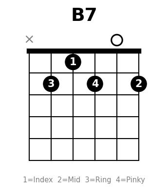
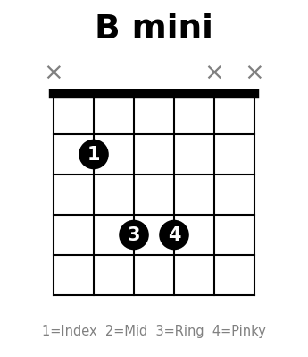
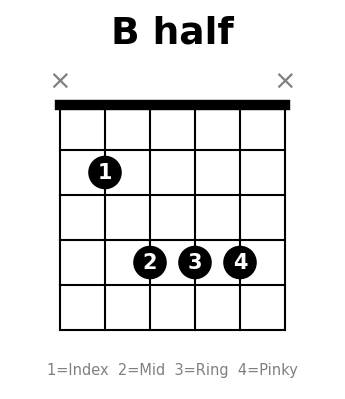

---
tags:
  - 參考
---

# B 和弦攻略

B 是繼 F 之後初學者第二個大魔王，因為在第 2 格做 A 型封閉。這裡整理從簡單到完整的按法，循序漸進練習。

## 1. B7（入門替代）



```
e ─── 2 ─── ② 中指
B ─── 0 ───
G ─── 2 ─── ④ 小指
D ─── 1 ─── ① 食指
A ─── 2 ─── ③ 無名指
E ─── X ───
```

!!! tip "適用場景"
    開放和弦，不用封閉。七和弦色彩略有不同但功能完全相同，流行歌大部分可直接代用。晴天、簡單愛裡出現 B 的地方都可以先用 B7。

## 2. 迷你 B（只按 3 弦）



```
e ─── X ───
B ─── X ───
G ─── 4 ─── ④ 小指
D ─── 4 ─── ③ 無名指
A ─── 2 ─── ① 食指
E ─── X ───
```

!!! tip "適用場景"
    只按 A D G 三弦，聲音薄但確實是 B 大和弦。適合過渡期或電吉他 power chord 風格。

## 3. 半封閉 B（封 4 弦）



```
e ─── X ───
B ─── 4 ─── ④ 小指
G ─── 4 ─── ③ 無名指
D ─── 4 ─── ② 中指
A ─── 2 ─── ① 食指封閉
E ─── X ───
```

!!! tip "適用場景"
    食指只壓 A 弦第 2 格，其餘用中指、無名指、小指分別按 D G B 弦第 4 格。比完整版少高低音弦，但聲音已經飽滿。

## 4. 完整大封閉 B（最終目標）


```
e ─── 2 ─── ① 食指封閉
B ─── 4 ─── ④ 小指
G ─── 4 ─── ③ 無名指
D ─── 4 ─── ② 中指
A ─── 2 ─── ① 食指封閉
E ─── X ───
```

## 練習路線

```
B7 → 迷你 B → 半封閉 B → 大封閉 B
```

1. **先用 B7 把歌彈順**，不要卡住讓練習中斷
2. **迷你 B 練手指展開**：食指第 2 格、無名指小指第 4 格的距離感
3. **半封閉加入更多弦**：練習中指、無名指、小指同時按第 4 格
4. **大封閉是時間問題**：跟 F 一樣，手指力量夠了自然壓得住

!!! warning "常見錯誤"
    - 中指、無名指、小指沒有立起來 → 會悶到旁邊的弦
    - 食指封閉時離琴衍太遠 → 靠近第 2 格金屬條省力
    - A 型封閉的難點在中間三根手指要擠在同一格 → 可以用無名指一根橫壓 D G B 三弦（進階技巧）
    - 不要跟 F 一起練 → 一天專注一個封閉和弦就好

## B vs F 差異

| | F（E 型封閉） | B（A 型封閉） |
|---|---|---|
| 位置 | 第 1 格 | 第 2 格 |
| 封閉弦數 | 6 弦全封 | 5 弦（不彈 E） |
| 難點 | 食指要壓滿 6 弦 | 中間三指要擠同格 |
| 替代 | Fmaj7 | B7 |

兩者練法不同，B 的食指壓力其實比 F 小（少一弦），但中間三指的排列比較擠。
