---
tags:
  - 參考
---

# 常用和弦指法

初學必備的開放和弦與封閉和弦指法參考。

## 開放和弦

### C {#c}
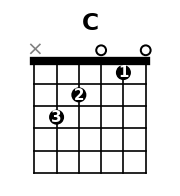

```
e ─── 0 ───
B ─── 1 ─── ← 食指
G ─── 0 ───
D ─── 2 ─── ← 中指
A ─── 3 ─── ← 無名指
E ─── X ───
```

### D {#d}
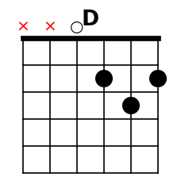

```
e ─── 2 ─── ← 中指
B ─── 3 ─── ← 無名指
G ─── 2 ─── ← 食指
D ─── 0 ───
A ─── X ───
E ─── X ───
```

### Em {#em}
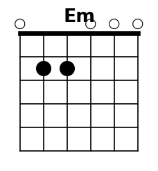

```
e ─── 0 ───
B ─── 0 ───
G ─── 0 ───
D ─── 2 ─── ← 中指
A ─── 2 ─── ← 無名指
E ─── 0 ───
```

### Am {#am}
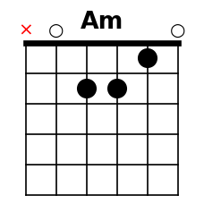

```
e ─── 0 ───
B ─── 1 ─── ← 食指
G ─── 2 ─── ← 中指
D ─── 2 ─── ← 無名指
A ─── 0 ───
E ─── X ───
```

### G {#g}
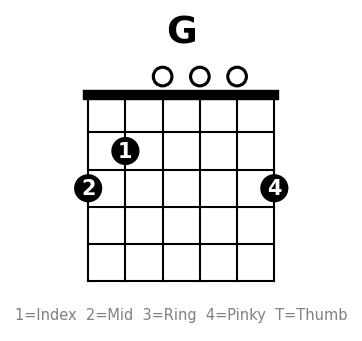

```
e ─── 3 ─── ← 小指
B ─── 0 ───
G ─── 0 ───
D ─── 0 ───
A ─── 2 ─── ← 食指
E ─── 3 ─── ← 中指
```

### E {#e}
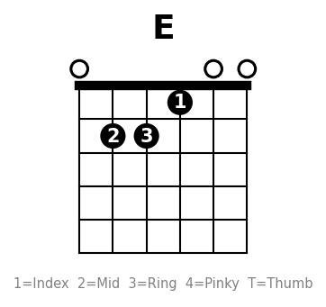

```
e ─── 0 ───
B ─── 0 ───
G ─── 1 ─── ← 食指
D ─── 2 ─── ← 無名指
A ─── 2 ─── ← 中指
E ─── 0 ───
```

### A {#a}
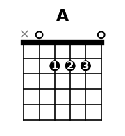

```
e ─── 0 ───
B ─── 2 ─── ← 食指
G ─── 2 ─── ← 中指
D ─── 2 ─── ← 無名指
A ─── 0 ───
E ─── X ───
```

### Dm {#dm}
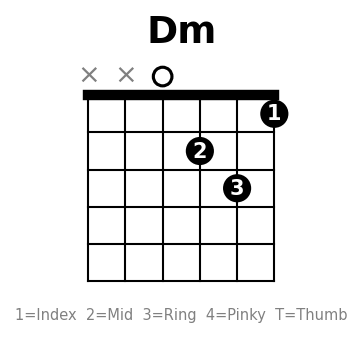

```
e ─── 1 ─── ← 食指
B ─── 3 ─── ← 無名指
G ─── 2 ─── ← 中指
D ─── 0 ───
A ─── X ───
E ─── X ───
```

## 常用變化和弦

### D/F# {#dfsharp}
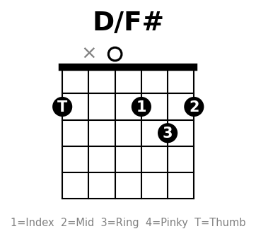

```
e ─── 2 ─── ← 中指
B ─── 3 ─── ← 無名指
G ─── 2 ─── ← 食指
D ─── 0 ───
A ─── X ───
E ─── 2 ─── ← 拇指
```

### Cadd9 {#cadd9}
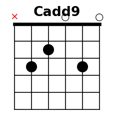

```
e ─── 0 ───
B ─── 3 ─── ← 小指
G ─── 0 ───
D ─── 2 ─── ← 中指
A ─── 3 ─── ← 無名指
E ─── X ───
```

### Em7 {#em7}
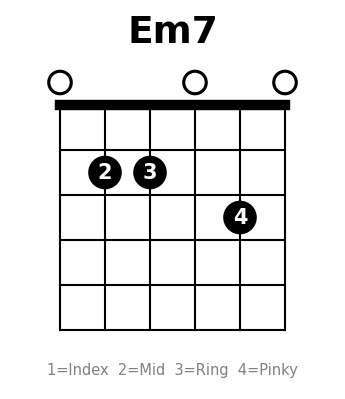

```
e ─── 0 ───
B ─── 3 ─── ← 小指
G ─── 0 ───
D ─── 2 ─── ← 中指
A ─── 2 ─── ← 無名指
E ─── 0 ───
```

> 簡化版：020000（只按 A 弦第 2 格，其餘全空弦），適合初學替代。

### Dsus4 {#dsus4}
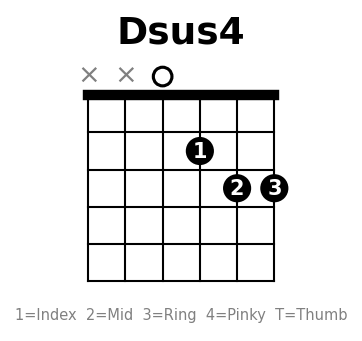

```
e ─── 3 ─── ← 無名指
B ─── 3 ─── ← 中指
G ─── 2 ─── ← 食指
D ─── 0 ───
A ─── X ───
E ─── X ───
```

### Am7 {#am7}
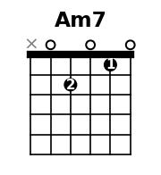

```
e ─── 0 ───
B ─── 1 ─── ← 食指
G ─── 0 ───
D ─── 2 ─── ← 中指
A ─── 0 ───
E ─── X ───
```

### D7 {#d7}
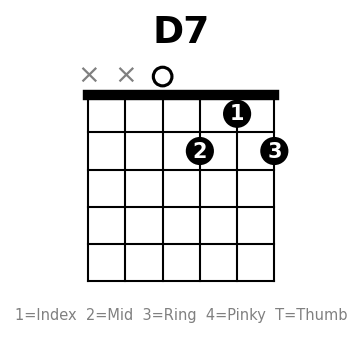

```
e ─── 2 ─── ← 無名指
B ─── 1 ─── ← 食指
G ─── 2 ─── ← 中指
D ─── 0 ───
A ─── X ───
E ─── X ───
```

### G7 {#g7}
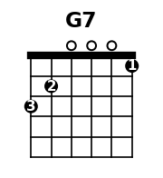

```
e ─── 1 ─── ← 食指
B ─── 0 ───
G ─── 0 ───
D ─── 0 ───
A ─── 2 ─── ← 中指
E ─── 3 ─── ← 無名指
```

### G/B {#gb}
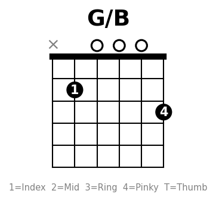

```
e ─── 3 ─── ← 小指
B ─── 0 ───
G ─── 0 ───
D ─── 0 ───
A ─── 2 ─── ← 食指
E ─── X ───
```

### G/F {#gf}
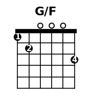

```
e ─── 3 ─── ← 小指
B ─── 0 ───
G ─── 0 ───
D ─── 0 ───
A ─── 2 ─── ← 中指
E ─── 1 ─── ← 食指
```

### Dm7 {#dm7}
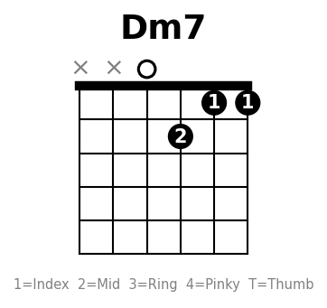

```
e ─── 1 ─── ← 食指
B ─── 1 ─── ← 食指
G ─── 2 ─── ← 中指
D ─── 0 ───
A ─── X ───
E ─── X ───
```

### D7/F# {#d7fsharp}
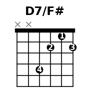

```
e ─── 2 ─── ← 無名指
B ─── 1 ─── ← 食指
G ─── 2 ─── ← 中指
D ─── 4 ─── ← 小指
A ─── X ───
E ─── X ───
```

### Gsus4 {#gsus4}
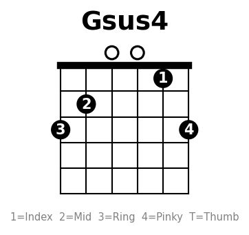

```
e ─── 3 ─── ← 小指
B ─── 1 ─── ← 食指
G ─── 0 ───
D ─── 0 ───
A ─── 2 ─── ← 中指
E ─── 3 ─── ← 無名指
```

### E7 {#e7}
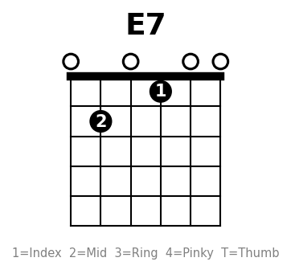

```
e ─── 0 ───
B ─── 0 ───
G ─── 1 ─── ← 食指
D ─── 0 ───
A ─── 2 ─── ← 中指
E ─── 0 ───
```

### Bm7（Bm 簡易替代） {#bm7}
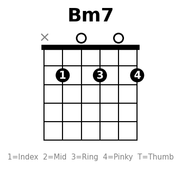

```
e ─── 2 ─── ← 小指
B ─── 0 ───
G ─── 2 ─── ← 無名指
D ─── 0 ───
A ─── 2 ─── ← 食指
E ─── X ───
```

## 封閉和弦（Barre Chords）

### B（A 型封閉，第 2 格） {#b}
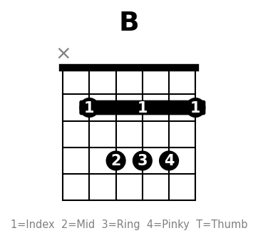

```
e ─── 2 ─── ← 食指封閉
B ─── 4 ─── ← 小指
G ─── 4 ─── ← 無名指
D ─── 4 ─── ← 中指
A ─── 2 ─── ← 食指封閉
E ─── X ───
```

### F（E 型封閉） {#f}
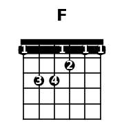

```
e ─── 1 ─── ← 食指封閉
B ─── 1 ─── ← 食指封閉
G ─── 2 ─── ← 中指
D ─── 3 ─── ← 小指
A ─── 3 ─── ← 無名指
E ─── 1 ─── ← 食指封閉
```

### Bm（Am 型封閉，第 2 格） {#bm}
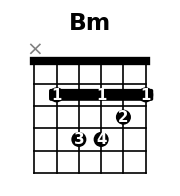

```
e ─── 2 ─── ← 食指封閉
B ─── 3 ─── ← 中指
G ─── 4 ─── ← 小指
D ─── 4 ─── ← 無名指
A ─── 2 ─── ← 食指封閉
E ─── X ───
```

### Bb（A 型封閉，第 1 格） {#bb}
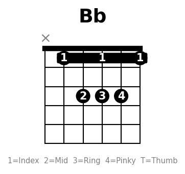

```
e ─── 1 ─── ← 食指封閉
B ─── 3 ─── ← 小指
G ─── 3 ─── ← 無名指
D ─── 3 ─── ← 中指
A ─── 1 ─── ← 食指封閉
E ─── X ───
```

### Fm（Em 型封閉，第 1 格） {#fm}
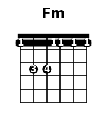

```
e ─── 1 ─── ← 食指封閉
B ─── 1 ─── ← 食指封閉
G ─── 3 ─── ← 無名指
D ─── 3 ─── ← 小指
A ─── 1 ─── ← 食指封閉
E ─── 1 ─── ← 食指封閉
```

## 練習建議

1. **先練開放和弦**：C → G → Am → Em → D 這五個搞定就能彈很多歌
2. **和弦轉換練習**：兩個和弦來回切，每次 1 分鐘計次
3. **目標**：每組轉換能在 1 分鐘內切 30 次以上
4. **封閉和弦**：等開放和弦熟了再挑戰 F，不要太早硬練會挫折

## 數字對應

| 數字 | 含義 |
|------|------|
| 0 | 空弦（不壓） |
| X | 不彈（悶音或跳過） |
| 1-N | 第幾格 |
