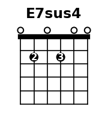
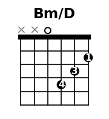
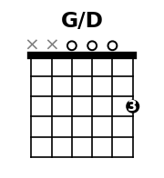
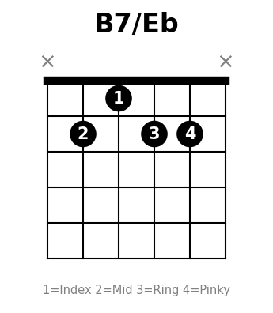
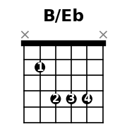
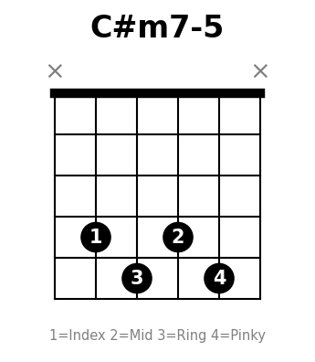

---
tags:
  - 參考
---

# 和弦指法

初學必備的開放和弦與封閉和弦指法參考。常用和弦在上方，較不常用的在下方。

> **弦序（粗→細）：** E A D G B e
>
> 指法字串從第6弦到第1弦，例如 `x32010` = × A3格 D2格 G空 B1格 e空

> **手指代號：** ① 食指 ② 中指 ③ 無名指 ④ 小指 T 拇指

## 開放和弦

### C {#c}

`x32010`

### D {#d}

`xx0232`

### Em {#em}

`022000`

### Am {#am}

`x02210`

### G {#g}

`320003`

### E {#e}

`022100`

### A {#a}

`x02220`

### Dm {#dm}

`xx0231`

## 常用變化和弦

### D/F# {#dfsharp}

`2x0232`

### Cadd9 {#cadd9}

`x32030`

### Em7 {#em7}

`022030`

### Dsus4 {#dsus4}

`xx0233`

### Am7 {#am7}

`x02010`

### D7 {#d7}

`xx0212`

### G7 {#g7}

`320001`

### G/B {#gb}

`x20003`

### G/F {#gf}

`120003`

### Dm7 {#dm7}

`xx0211`

### D7/F# {#d7fsharp}

`xx4212`

### Gsus4 {#gsus4}

`320013`

### E7 {#e7}

`020100`

### Bm7（Bm 簡易替代） {#bm7}

`x20202`

## 封閉和弦（Barre Chords）

### B（A 型封閉，第 2 格） {#b}

`x24442`

### F（E 型封閉） {#f}

`133211`

### Bm（Am 型封閉，第 2 格） {#bm}

`x24432`

### Bb（A 型封閉，第 1 格） {#bb}

`x13331`

### Fm（Em 型封閉，第 1 格） {#fm}

`133111`

## 練習建議

1. **先練開放和弦**：C → G → Am → Em → D 這五個搞定就能彈很多歌
2. **和弦轉換練習**：兩個和弦來回切，每次 1 分鐘計次
3. **目標**：每組轉換能在 1 分鐘內切 30 次以上
4. **封閉和弦**：等開放和弦熟了再挑戰 F，不要太早硬練會挫折

## 數字對應

| 數字 | 含義 |
|------|------|
| 0 | 空弦（不壓） |
| X | 不彈（悶音或跳過） |
| 1-N | 第幾格 |

## 進階和弦（較不常用）

### E7sus4 {#e7sus4}

`020200`

### Bm/D {#bmd}

`xx0432`

### G/D {#gd}

`xx0003`

### B7/Eb {#b7eb}

`x21220`

### B/Eb {#beb}

`x2444x`

### C#m7-5 {#csharpm7b5}

`x4545x`

> 半減七和弦，出現在「世界末日」副歌。
