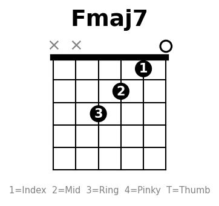
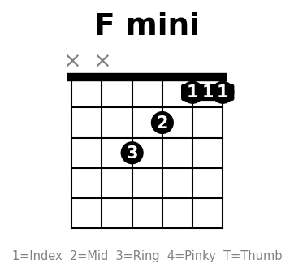
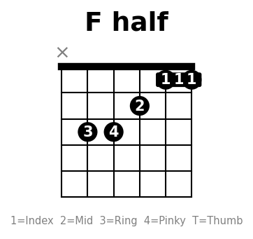

---
tags:
  - 參考
---

# F 和弦攻略

F 是初學者最大的關卡，這裡整理從簡單到完整的按法，循序漸進練習。

## 1. Fmaj7（入門替代）



```
e ─── 0 ───
B ─── 1 ─── ① 食指
G ─── 2 ─── ② 中指
D ─── 3 ─── ③ 無名指
A ─── X ───
E ─── X ───
```

!!! tip "適用場景"
    聲音柔和，流行歌大部分場合可以直接代 F。先用這個把歌彈順。

## 2. 小封閉 F（封 2 弦）



```
e ─── 1 ─── ① 食指封閉
B ─── 1 ─── ① 食指封閉
G ─── 2 ─── ② 中指
D ─── 3 ─── ③ 無名指
A ─── X ───
E ─── X ───
```

!!! tip "適用場景"
    食指只壓 1、2 弦第一格，比大封閉輕鬆很多，聲音已經是 F。

## 3. 半封閉 F（封 4 弦）



```
e ─── 1 ─── ① 食指封閉
B ─── 1 ─── ① 食指封閉
G ─── 2 ─── ② 中指
D ─── 3 ─── ④ 小指
A ─── 3 ─── ③ 無名指
E ─── X ───
```

!!! tip "適用場景"
    比完整版少低音 E 弦，但聲音飽滿，適合掃弦。

## 4. 完整大封閉 F（最終目標）


```
e ─── 1 ─── ① 食指封閉
B ─── 1 ─── ① 食指封閉
G ─── 2 ─── ② 中指
D ─── 3 ─── ④ 小指
A ─── 3 ─── ③ 無名指
E ─── 1 ─── ① 食指封閉
```

## 練習路線

```
Fmaj7 → 小封閉 F → 半封閉 F → 大封閉 F
```

1. **先用 Fmaj7 把歌彈順**，不要卡在 F 上讓練習中斷
2. **小封閉練食指平壓感覺**：食指側面貼弦，靠近琴衍（fret）
3. **半封閉加入低音弦**：無名指和小指的獨立性要練
4. **大封閉是時間問題**：手指力量夠了自然壓得住，別硬練到痛

!!! warning "常見錯誤"
    - 食指用指腹壓 → 應該用側面
    - 離琴衍太遠 → 靠近金屬條省力
    - 拇指位置太高 → 放在琴頸正後方中間
    - 硬練到手痛 → 每次練 5 分鐘休息，慢慢來
