---
tags:
  - 參考
---

# 烏克麗麗和弦指法

烏克麗麗只有 4 弦（G C E A），大部分吉他和弦都有對應。

> **弦序（粗→細）：** G C E A
>
> 指法字串從 G 弦到 A 弦，例如 `0003` = G空 C空 E空 A3格
>
> **轉位和弦規則：** 遇到 slash 和弦（如 D/F#、G/B）直接忽略 "/" 後面的低音，彈基本和弦即可。烏克沒有低音弦，差異極小。

> **手指代號：** ① 食指 ② 中指 ③ 無名指 ④ 小指

## 基本和弦

### C

`0003`

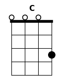

### G

`0232`

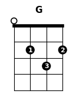

### Am

`2000`

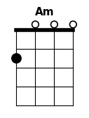

### Em

`0402`

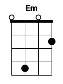

### D

`2220`

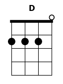

### Dm

`2210`

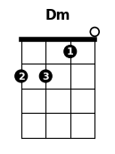

### E

`1402`

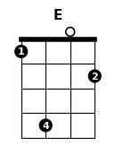

### A

`2100`

### F

`2010`

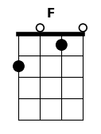

## 七和弦 / 變化和弦

### Am7

`0000`（全空弦！）

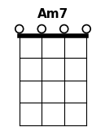

### Em7

`0202`

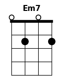

### Dm7

`2213`

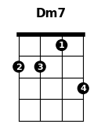

### D7

`2223`

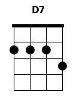

### G7

`0212`

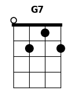

### Cmaj7

`0002`

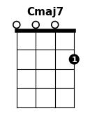

### E7

`1202`

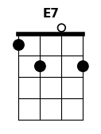

### B7

`2322`

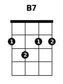

### A7

`0100`

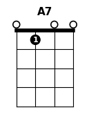

## 封閉和弦

### Bm

`4222`

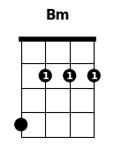

### Bb

`3211`

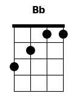

### Fm

`1013`

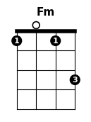

### B

`4322`

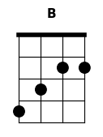

## sus4 / add 系列

### Dsus4

`2230`

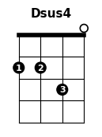

### Gsus4

`0233`

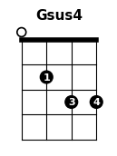

### Cadd9

`0203`

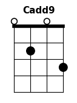

## 練習建議

- Am7 = 全空弦，烏克最簡單的和弦
- 烏克上 F 是開放和弦，不用封閉
- 本站所有譜都可以用烏克彈，slash 和弦直接忽略斜線後的音
